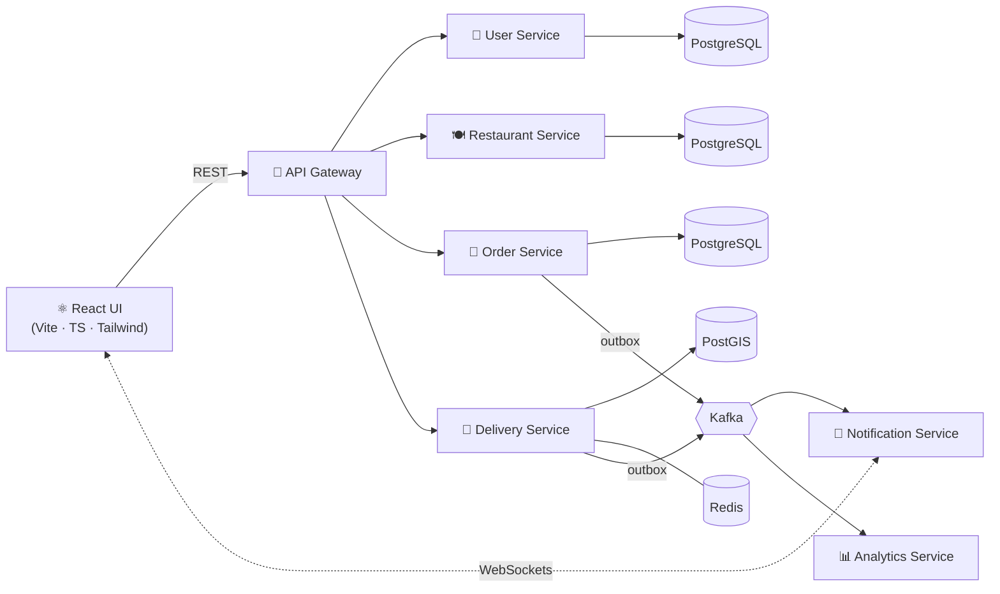

<!-- ───────────── HEADER ───────────── -->

 

 

<!-- ───────────── PILLARS ───────────── -->
## ⚡ What I do

<table>
<tr>
<td width="33%" valign="top">

### 🛫 Enterprise Systems
Owning features end to end on an **aviation ERP**: permits, flight dispatch, GST invoicing and briefing PDFs. Multi-step flows, role-based UI, race-condition and data-integrity fixes in production.

</td>
<td width="33%" valign="top">

### 🤖 AI Engineering
Shipping **LLM features** that do real work: an email-to-structured-permit pipeline (Microsoft Graph + GPT-4o-mini), Gemini trip summaries, and a **tool-calling ops agent** over live FMS data.

</td>
<td width="33%" valign="top">

### 🏗️ Distributed Backends
Designing **event-driven microservices**: database-per-service, Kafka with the transactional outbox pattern, PostGIS for geospatial data, Redis, WebSockets and Docker.

</td>
</tr>
</table>

<!-- ───────────── FEATURED ───────────── -->
## 🚀 Featured work

### 🛵 SmartFleet: real-time delivery & fleet platform

Seven NestJS services behind an API gateway, a React/Vite/TypeScript/Tailwind frontend, database-per-service on PostgreSQL, and reliable event publishing through a Kafka outbox. Documented end to end (README, HLD, LLD, DB and API design, setup guide).

`NestJS` `PostgreSQL` `PostGIS` `Prisma` `Redis` `Kafka` `WebSockets` `Docker` `pnpm workspaces` `React`

 

<table>
<tr>
<td width="50%" valign="top">

### 🧠 FMS Ops Agent
A standalone **AI agent** that answers flight and permit status questions from Aerotech FMS data. Gemini tool-calling, an agent loop, and a tool registry covering flight, permit, invoice and email tools.

`NestJS` `Prisma` `Gemini`

</td>
<td width="50%" valign="top">

### 🧳 Rajasthan Cabs & Tours (Live)
A production **travel booking platform** built end to end for a real client: dynamic tour and cab pages, a full SEO suite (Open Graph, Twitter Cards, canonical URLs, 20+ keywords) and dual Nodemailer booking emails.

`Next.js` `TypeScript` `Tailwind` `Nodemailer`

</td>
</tr>
</table>

<!-- ───────────── EXPERIENCE ───────────── -->
## 💼 Experience

| | Role | Company | Highlights |
|:-:|:--|:--|:--|
| 🟢 | **Full-Stack Developer** *Present* | **Aerotech FMS** · Gurugram | Aviation ERP, AI permit-email pipeline, Gemini features, PDF generation, RocketRoute + PostGIS integration |
| 🔵 | **Junior Full-Stack Developer** *Aug 2025 – Dec 2025* | **Nextify Solutions** · Lucknow | 30+ page SEO-optimised Next.js site; Lighthouse performance **+30%** via lazy loading, code splitting, image optimisation |
| 🟣 | **Junior Full-Stack Developer** *Aug 2024 – Feb 2025* | **xBesh Technologies** · Noida | Accessible UI components for a library adopted by **1,000+ developers**; React, TypeScript, Redux, MongoDB |

<!-- ───────────── STACK ───────────── -->
## 🛠️ Tech arsenal

**Frontend** 

**Backend & Data** 

**Tooling** 

**Currently learning** 

<!-- ───────────── STATS ───────────── -->
## 📊 GitHub & coding stats

  

 

🧩 **LeetCode:** 646 problems solved · rating ~1,656 · top ~17% · 365-day streak

 

<!-- ───────────── FOOTER ───────────── -->

### 📫 Let's build something great together
**shivamkumarpandey3971@gmail.com**

